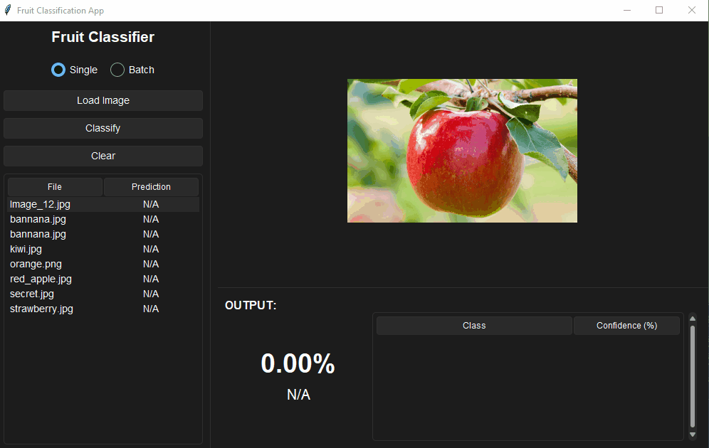
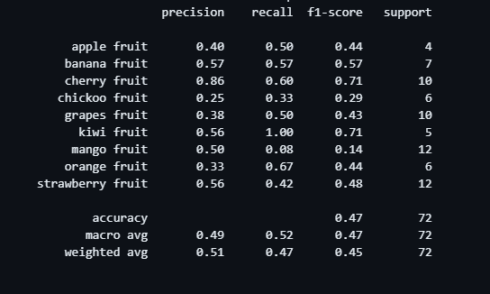
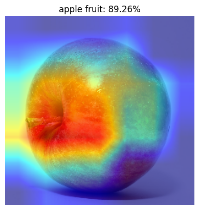
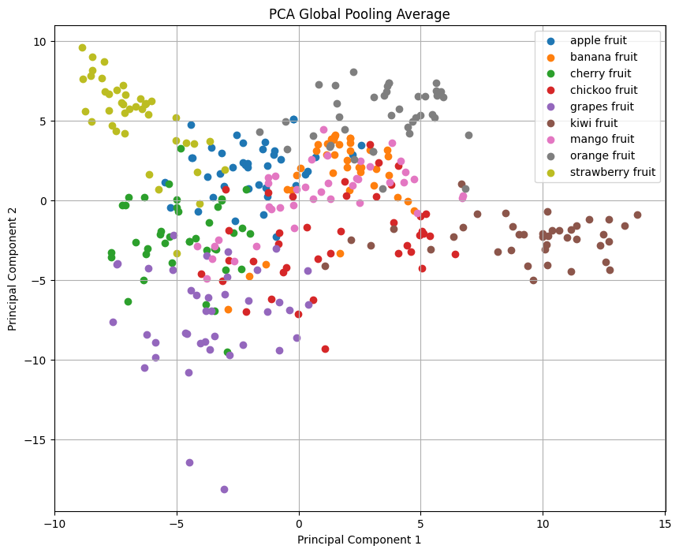
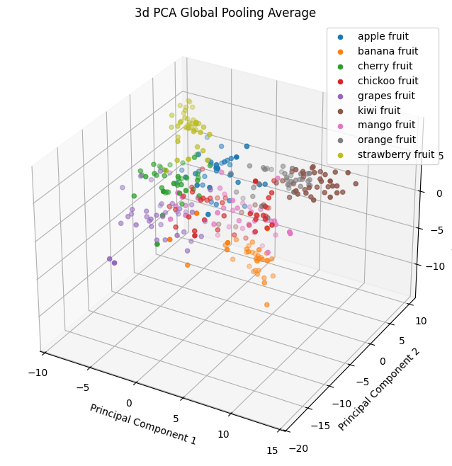

# Fruit Classification Project

Welcome to the Fruit Classification App! This application leverages machine learning and a convolutional neural network to identify and classify different types of fruits from images. It supports both single image and batch predictions, with confidence scores calculated for all training labels.

## Demo



## Main Technologies Used

- **Python 3.10.5**
- **TensorFlow/Keras**: For building and training the neural network model.
- **Scikit-learn**: For additional machine learning utilities.
- **NumPy** and **Pandas**: For data manipulation.
- **Matplotlib**: For data visualization.
- **Jupyter Notebooks**: For visualization and testing.
- **Tkinter**: For the GUI.

## Model

More detailed analyis and testing can be found in the `/notebooks`.

### Accuracy:



### GradCam:

Red area is is main focus of the model and played the greatest impact on model prediciton. Blue areas had the least impact



### Clustering of Fruits using PCA:





## Dataset Source

The dataset used in this project is sourced from [Kaggle](https://www.kaggle.com/datasets/shreyapmaher/fruits-dataset-images). It includes images of various fruits, organized into labeled folders. Due to the size of the training data, it is not included in the repository. To use it:

1. Download the dataset from Kaggle.
2. Unzip the downloaded file.
3. Drag the unzipped folders into the `data/raw` directory. Remove all directories in `data/raw` first.

### Example

If your dataset contains images of apples and bananas, the folder structure should look like this:

```
data/
    raw/
        apple/
        banana/
```

The application uses these folder names as the classes to predict.

## How to Run the Application

### Prerequisites

- Ensure you have Python 3.10.5 installed on your system.
- Install virtualenv if not already installed:
  ```bash
  pip install virtualenv
  ```

### Setting Up the Environment

1. Clone the repository:

   ```bash
   git clone git@github.com:anthonynuge/Fruit-Identification-CNN.git
   cd fruit-classification
   ```

2. Create and activate a virtual environment:

   ```bash
   virtualenv venv
   source venv/bin/activate   # On Windows: venv\Scripts\activate
   ```

3. Install the required dependencies:

   ```bash
   pip install -r requirements.txt
   ```

4. Run the application:

   ```bash
   python main.py
   ```

## How to Train Your Own Model

### Step 1: Delete the Old Model

1. Locate the model file (e.g., `modelV3.keras`) in the project directory.
2. Delete the file:
   ```bash
   rm modelV3.keras
   ```

### Step 2: Add Your Dataset

1. Add folders containing your new fruit images to the `data/raw` directory. Ensure the folder names match the fruit labels.
2. The folder structure should look like this:
   ```
   data/
       raw/
           apple/
           banana/
           orange/
           ... (new fruit folders // can be other things besides fruit but have not tested fully)
   ```

### Step 3: Train New Models

On first start if no keras model is present the app will train a new model automatically with the availble training data in data/raw. Below is if you want to train multiple models for testing purposes and comparison. Model names will be incremented.

1. Run the training script(Manual Training):
   ```bash
   python train.py
   ```
2. The script will process the data, perform data augmentation to simulate additional images, train the model, and save a new `modelV*.keras` file in the project directory.

3. Once training is complete, you can restart the application to use the newly trained model.

### Test Images

A couple of test images are included in the `data/test` directory for evaluating the model's predictions.

---
